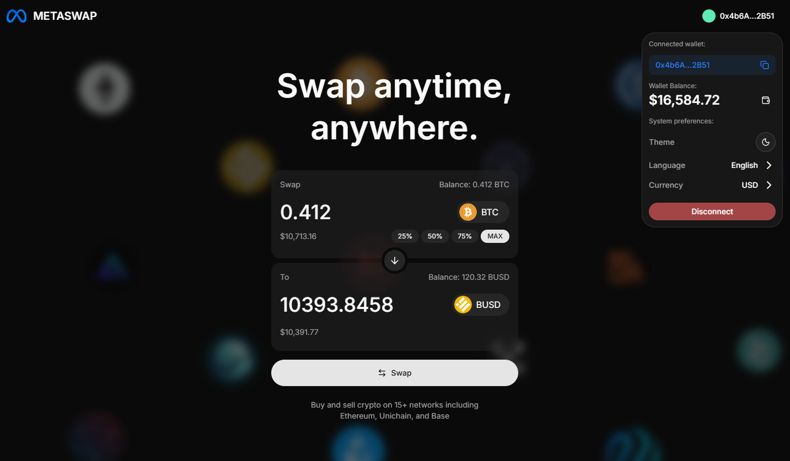
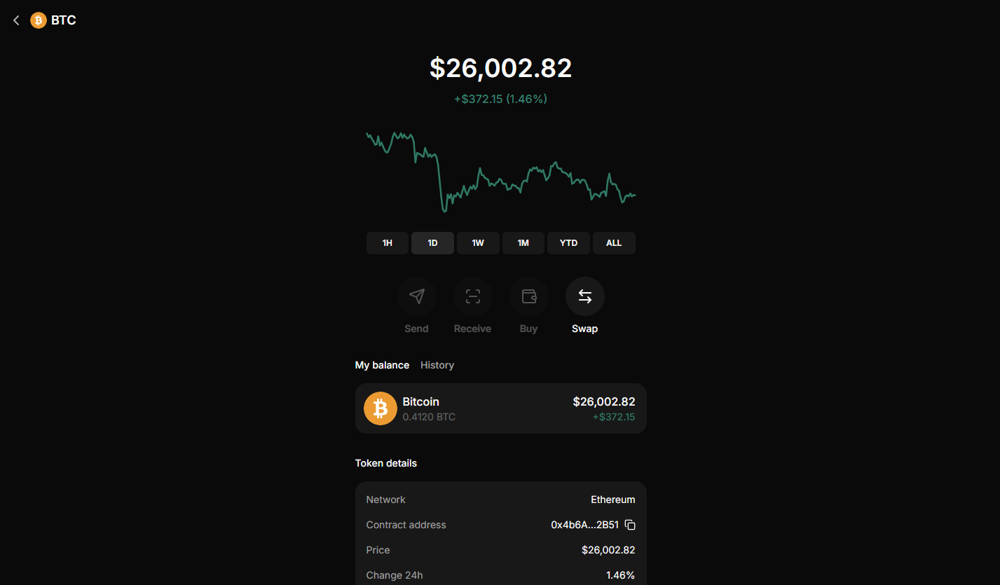

# 99Tech Code Challenge #1

Note that if you fork this repository, your responses may be publicly linked to this repo.  
Please submit your application along with the solutions attached or linked.

It is important that you minimally attempt the problems, even if you do not arrive at a working solution.

## Submission

You can either provide a link to an online repository, attach the solution in your application, or whichever method you prefer.
We're cool as long as we can view your solution without any pain.

## 🧩 Problem 1 — Three Ways to Sum to N

Implement **3 unique solutions** for a function that sums all numbers from 1 to `n`.

Each solution should use a different approach — e.g.:

- Iterative loop
- Mathematical formula
- Recursion

---

## 💰 Problem 2 — Fancy Form (Currency Swap)

Create a **currency swap form** that allows users to convert from one token to another.

🧠 Built with:

- React + TypeScript
- Redux Toolkit
- React Hook Form
- Clean Architecture + SOLID principles
- Framer Motion animations
- TailwindCSS + ShadCN UI

🌐 **Live Demo:** [metaswap-sigma.vercel.app](https://metaswap-sigma.vercel.app/)

### 📸 Screenshots

| Interface                       | Swapping                        | Result                         |
| ------------------------------- | ------------------------------- | ------------------------------ |
|  |  |  |

---

## ⚛️ Problem 3 — Messy React

Analyze and refactor a React + TypeScript component to:

- Identify computational inefficiencies
- Remove anti-patterns
- Improve readability & performance

A detailed analysis file is included under:

---

## 👨‍💻 Author

**William (NicolasWillyam)**  
📍 [GitHub Profile](https://github.com/NicolasWillyam)

---
